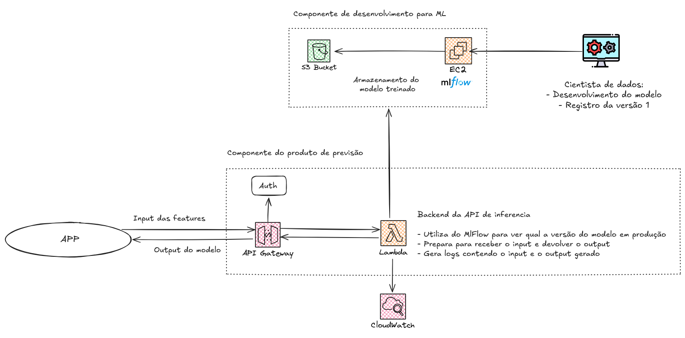
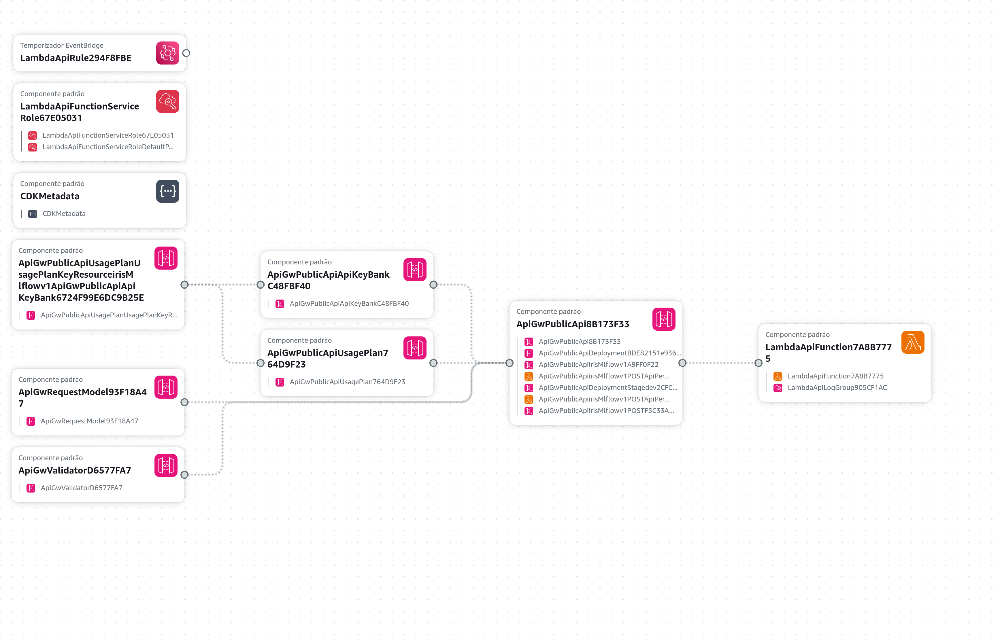

# API de Machine Learning com IaC

Projeto de uma API para predição utilizando o ML Flow, Terraform e AWS CDK.
<div style="display: inline_block"><br>
  
  
  
  
</div>

```
├── aws
│   ├── Stack de construção da API a ser gerenciada pelo AWS CDK
├── docs
│   ├── Toda a documentação do projeto
├── src
│   ├── Código de treinamento e inferência do modelo e 
├── terraform-mlflow
│   ├── Stack de construção da Infra com o ML Flow
├── .dockerignore
├── .gitignore
├── app.py (Invocado para iniciar a síntese dos recuros via AWS CDK)
├── cdk.json (Artefato para utilização do AWS CDK)
├── requirements.app.txt (Requisitos para a API)
└── requirements.dev.txt (Requisitos desenvolvimento dos recursos)
```

## Arquitetura do projeto
1) **Componente de desenvolvimento:**
 
 *Construção*: IaC com [Terraform](terraform-mlflow/) 
 
 - Máquina AWS EC2 configurada com um servido ML Flow.
 - Acesso remoto ao servidor para registar o modelo treinado.
 - Modelo treinado fica armazenado no AWS S3.

2) **Componente de predição:**

 *Construção*: IaC com [AWS CDK](aws/)

 - API criada utilizando uma Lambda como Backend.
 - AWS API Gateway faz toda a gestão de filas das chamadas e autenticação.
 - Todos os logs são salvos no CloudWatch (possibilidade de métricas e alarms em tempo real).
 - Estratégia de Warmup da lambda que é invocada a cada 2min com um evento vazio para permanecer com o Kernel ativo.



## Criando o componente de DESENVOLVIMENTO

Utilizado o Terraform para construir a infraestrutura necessária. Comandos para replicar a infra:

~~~bash:
cd terraform-mlflow
terraform init # Apenas necessário na primeira vez

# A cada nova alteração e deploy
terraform plan
terraform apply
~~~

## Criando o componente com a API

Utilizado o AWS CDK (CloudFormation) para construir a infraestrutura necessária. Comandos para replicar a infra:

~~~bash:
# Apenas necessário na primeira vez
pip install -r requirements.dev.txt
cdk bootstratp

# A cada nova alteração e deploy
cdk diff
cdk deploy
~~~

Mostrando o Application Composer demonstrando os recuros criados para a API.


## Utilizando a API

Todos os detalhes para recplicar as chamadas de api estão na pasta [docs/](docs/). 

Arquivo [input_hml.json](docs/input_hml.json) contem um exemplo de input que retorna uma previsão real verdadeira. 

Arquivo [MLFLOW_IRIS.postman_collection.json](docs/MLFLOW_IRIS.postman_collection.json) é uma collection importada do Postman já com o esquema de requisição, url e local para adicionar a chave de autenticação. É possível replicar toda a estrutura carregando essa collection no [Postman](https://www.postman.com/).
